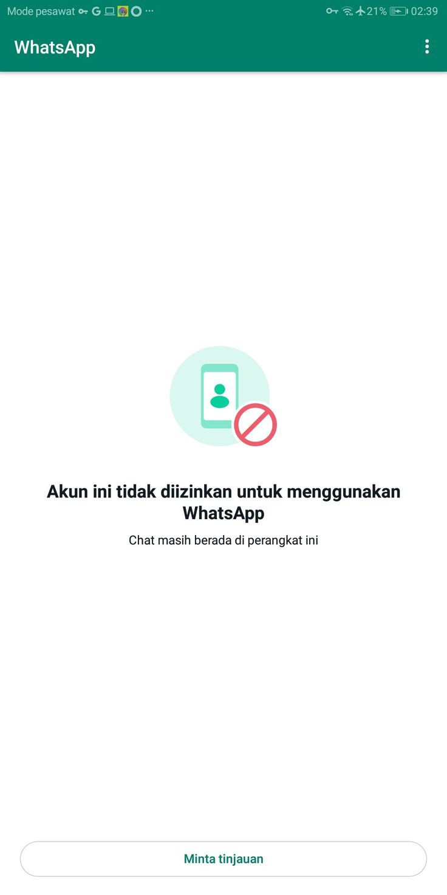

# REPORT-WA



## Deskripsi
Skrip ini digunakan untuk menjalankan pelaporan otomatis di WhatsApp menggunakan tool yang disediakan. Pastikan semua dependensi telah terinstal dengan benar sebelum menjalankan skrip ini.

## Persyaratan
- Python
- jq (Untuk parsing JSON)
- Git
- curl
- w3m

## Instalasi

Jalankan perintah berikut di terminal Anda:

```bash
pkg update
pkg install jq -y
pkg install curl -y
pkg install w3m -y
pkg install yarn nodejs -y
git clone https://github.com/GALIRUS404/REPORT-WA
cd REPORT-WA
bash gas.sh
